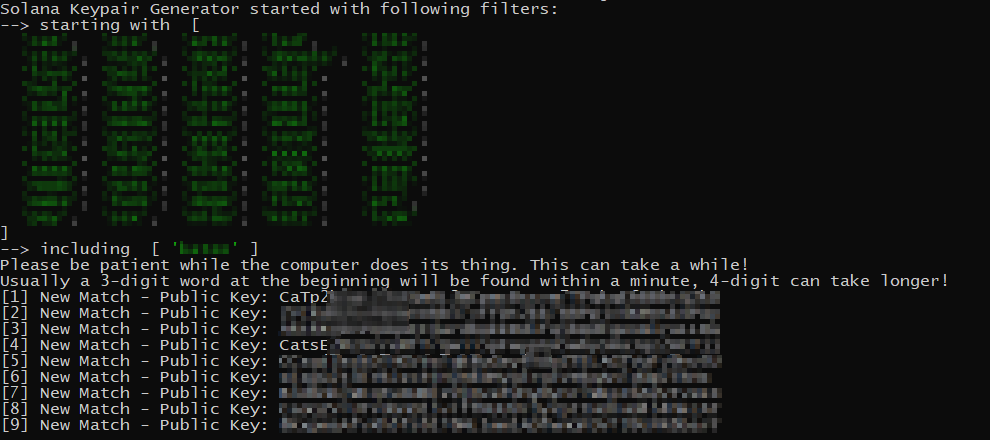

## what it does



this tool comes in handy if you want to start a solana project and want a customized solana address.
it basically generates addresses and outputs you the credentials for accounts that have a matching name.
Usually when displaying Solana addresses, most services cut everything between the first 4 and the last 4 digits.
This tool gives you the opportunity to get a cool address for your project!
Please do not use it extensively because you basically spam the Solana network with it.

## install


git clone this repository, then switch to the new folder and execute

```
npm install
```


## how to use

edit the file index.js and change the parameters on the top of the file for your needs

then
```
npm start
```

## buy me a coffee

you can send Solana to 31b6WoZ1H8Lm8t1zwMEigJsBg6wqq3iRvwipAT***iAmARt*** (see the last few digits, anon? **i am art**)


___
